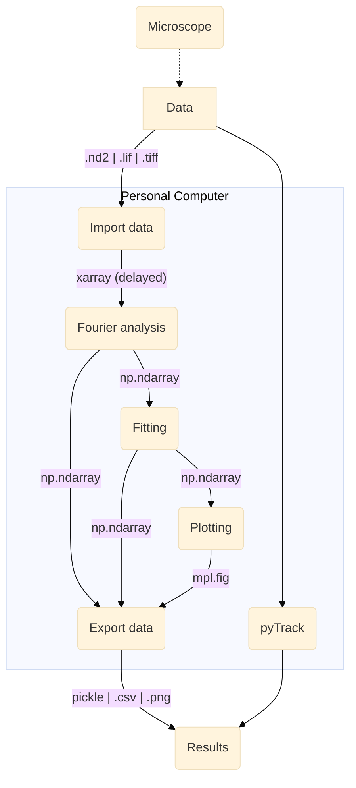

# Open DDM 

A Python package to analyse an image sequence and measure diffusion properties through Fourier techniques

## Installation for developers

```
git clone git@github.com:koenderinklab/ddmPilotCode.git ddm
cd ddm
conda env create -f environment.yml
conda activate ddm_env
pip install -e .
``` 

## Data processing workflow


