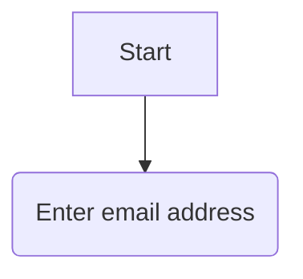
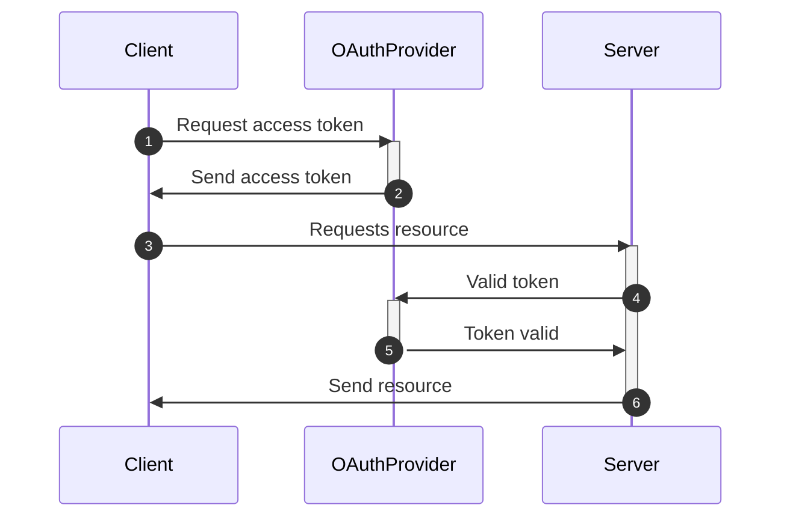
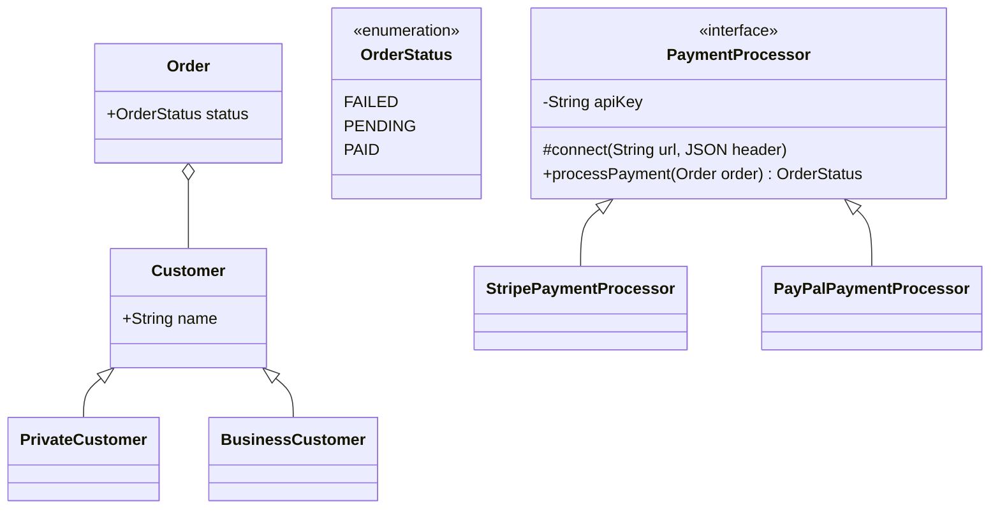
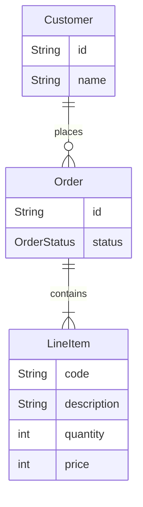

## Example flowchart

```mermaid
flowchart
    S[Start] --> B(Enter email address)


```

## Example sequence diagram

```mermaid
sequenceDiagram
autonumber
    participant C as Client
    participant OAuthProvider
    participant Server
    C->>OAuthProvider: Request access token
    activate OAuthProvider
    OAuthProvider->>C: Send access token
    deactivate OAuthProvider
    C->>Server: Requests resource
    activate Server
    Server->>OAuthProvider: Valid token
    activate OAuthProvider
    OAuthProvider->>Server: Token valid
    deactivate OAuthProvider
    Server->>C: Send resource
    deactivate Server

```

## Example class diagram

```mermaid
classDiagram
    class Order {
        +OrderStatus status
    }
    class OrderStatus {
        <<enumeration>>
        FAILED
        PENDING
        PAID
    }
    class PaymentProcessor {
        <<interface>>
        -String apiKey
        #connect(String url, JSON header)
        +processPayment(Order order) OrderStatus
    }
    class Customer {
        +String name
    }
    Customer <|-- PrivateCustomer
    Customer <|-- BusinessCustomer
    PaymentProcessor <|-- StripePaymentProcessor
    PaymentProcessor <|-- PayPalPaymentProcessor

    Order o-- Customer
```

## Example entity relationship diagram

```mermaid
erDiagram

    Customer ||--o{ Order : places
    Order ||--|{ LineItem : contains
    Customer {
        String id
        String name
    }
    Order {
        String id
        OrderStatus status
    }
    LineItem {
        String code
        String description
        int quantity
        int price
    }
```